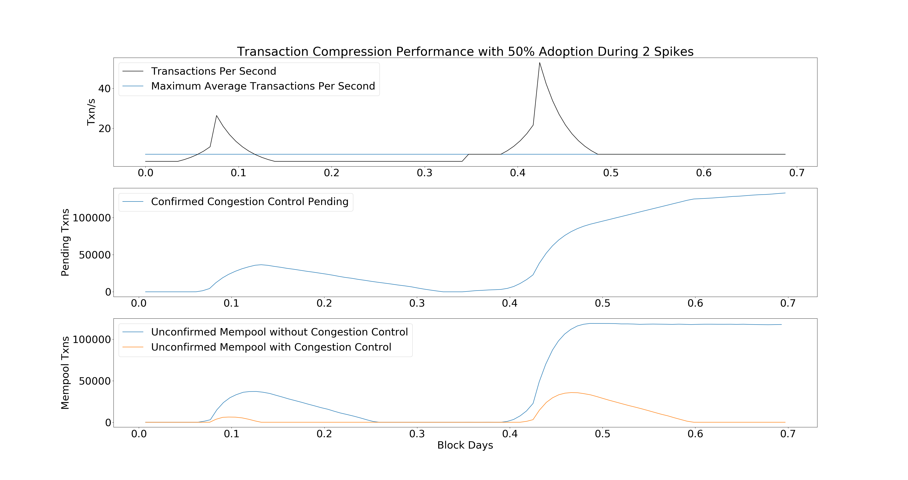
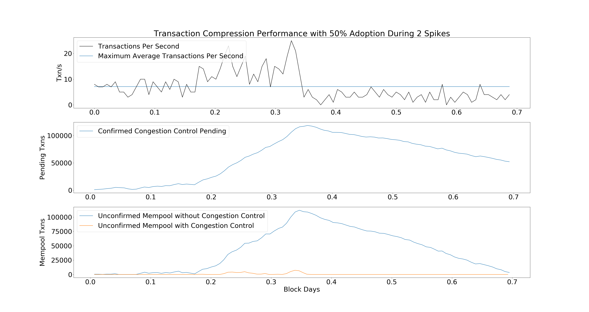

The below simulation results show that OP_CHECKTEMPLATEVERIFY is an effective too to
reduce network strain in Bitcoin. This is based on the same simulation used in the BIP.



The chart shows how the Bitcoin Mempool will respond during two periods of intense transaction demand. During the first period, rates go back to zero. In the second period, rates remain at the max transactions per second threshold.

The last chart shows that the Mempool is much less congested when using OP_CHECKTEMPLATEVERIFY than without it.


## Walkthrough
This section walks through the code to show how the simulation was generated.


These are some basic parameters. They can be modified to change the behavior of
the simulation. The most important parameters to consider are `COMPRESSABLE`,
which informs us what percent of demand can go into OP_CHECKTEMPLATEVERIFY.
```python
import numpy as np
import matplotlib.pyplot as plt
PHASES = 50
PHASE_LENGTH = 1
SAMPLES = PHASE_LENGTH * PHASES
AVG_TX = 235
MAX_BLOCK_SIZE = 1e6
AVG_INTERVAL = 10.0*60.0
TXNS_PER_SEC = 0.5*MAX_BLOCK_SIZE/AVG_TX/AVG_INTERVAL
COMPRESSABLE = 0.50
BRANCHING_FACTOR = 4.0
EXTRA_WORK_MULTIPLIER = 1/(1-1.0/BRANCHING_FACTOR)
DAYS = np.array(range(SAMPLES))/144.0
DAYS_OFFSET = PHASES/144.0*PHASE_LENGTH

def show_legend(for_):
    plt.legend(for_, [l.get_label() for l in for_], loc='upper left')
plt.rcParams["font.size"] = "31"
```


The function `get_rate` tells our simulation how to generate the curve of transactions per second.
Modifying it would allow you to simulate different demand curves.
```python
def generate_rates(phase):
    if phase >= 20:
        return TXNS_PER_SEC
    elif phase > 10:
        return 1.25**(20 - phase) *TXNS_PER_SEC
    elif phase >= 5:
        return 1.25**(phase-5)*TXNS_PER_SEC
    else:
        return TXNS_PER_SEC
rates = [generate_rates(phase) for phase in range(PHASES/2)] + [generate_rates(phase)*2 for phase in range(PHASES/2)]
def get_rate(phase):
    return rates[phase]

plt.subplot(3,1,1)
plt.title("Transaction Compression Performance with %d%% Adoption During 2 Spikes"%(100*COMPRESSABLE))
plt.ylabel("Txn/s")

p_full_block, = plt.plot([DAYS[0], DAYS[-1]],
        [MAX_BLOCK_SIZE/AVG_TX/AVG_INTERVAL]*2,
         label="Maximum Average Transactions Per Second")
T = np.array(range(0, SAMPLES, PHASE_LENGTH))/144.0
p5, = plt.plot(T, rates, "k-", label="Transactions Per Second")
show_legend([p5, p_full_block])
```
`compressed()` simulates a network running where a portion of users use OP_CHECKTEMPLATEVERIFY.

```python
def compressed(compressable = COMPRESSABLE):
    backlog = 0
    postponed_backlog = 0
	# reserve space for results
    results_confirmed = [0]*SAMPLES
    results_unconfirmed = [0]*SAMPLES
    results_yet_to_spend = [0]*SAMPLES
    total_time = [0]*(SAMPLES)
    for phase in range(PHASES):
        for sample_idx in range(PHASE_LENGTH*phase, PHASE_LENGTH*(1+phase)):
			# Sample how much time until the next block
            total_time[sample_idx] = np.random.poisson(AVG_INTERVAL)
			# Random sample a number of transactions that occur in this block time period
            # Equivalent to the sum of one poisson per block time
            # I.E., \sum_1_n Pois(a) = Pois(a*n)
            txns = np.random.poisson(get_rate(phase)*total_time[sample_idx])
            postponed = txns * compressable
			# Add the non postponed transactions to the backlog as the available weight
            weight = (txns-postponed)*AVG_TX + backlog
			# Add the postponed to the postponed_backlog
            postponed_backlog += postponed*AVG_TX * EXTRA_WORK_MULTIPLIER # Total extra work
			
			# If we have more weight available than block space
            if weight > MAX_BLOCK_SIZE:
				# clear what we can -- 1 MAX_BLOCK_SIZE
                results_confirmed[sample_idx] += MAX_BLOCK_SIZE
                backlog = weight - MAX_BLOCK_SIZE
            else:
				# Otherwise, we have some space to spare for postponed backlog
                space = MAX_BLOCK_SIZE - weight
                postponed_backlog = max(postponed_backlog-space, 0)
                backlog = 0
			# record results in terms of transactions
            results_unconfirmed[sample_idx] = float(backlog)/AVG_TX
            results_yet_to_spend[sample_idx] = postponed_backlog/EXTRA_WORK_MULTIPLIER/AVG_TX

    return results_unconfirmed, results_yet_to_spend, np.cumsum(total_time)/(60*60*24.0)
compressed_txs, unspendable, blocktimes_c = compressed()
```

`normal()` simulates a network running where no users use OP_CHECKTEMPLATEVERIFY.
```python
def normal():
    a,_,b = compressed(0)
    return a,b
normal_txs, blocktimes_n = normal()
```


Now we just glue the data together to display it.
```python

plt.subplot(3,1,2)
plt.ylabel("Pending Txns")
p7, = plt.plot(blocktimes_c1, unspendable,
			   label="Confirmed Congestion Control Pending")
show_legend([p7])

plt.subplot(3,1,3)
plt.ylabel("Mempool Txns")
p1, = plt.plot(blocktimes_n, normal_txs,
			   label="Unconfirmed Mempool without Congestion Control")
p3, = plt.plot(blocktimes_c1, compressed_txs,
			   label="Unconfirmed Mempool with Congestion Control")
show_legend([p1, p3])

plt.xlabel("Block Days")
plt.show()
```


## Limitations

Simulations are cheap facsimiles of reality; they does not generally accurately
model the universe. Even simulations generated by  replaying real past events
do not predict what will happen in the future.

This simulation in particular makes some strong assumptions about miner
behavior. Miners always fill blocks as much as possible. In actuality, miners
often mine blocks which aren't full even when there is a backlog of
transactions.

This simulation does not make any attempt at estimating the fees savings. Fees may be non-linearly correlated with the mempool length, or they may be wholly unaffected depending on consumer behavior, which can be measured empirically, but does not necessarily predict future behavior. A good example of why past data may not be predictive is that people may care to have transactions confirmed much more in response to political news.

This simulation also does not address Jevons Paradox -- whereby by making a
system more efficient to use, net consumption is increased, rather than
decreased. Such market questions are beyond the scope of the simulation.

Fortunately, for many of the mismatches between expectation and reality this
simulation is somewhat robust as a comparative measure. Unless miners are
specifically discriminating against `OP_CHECKTEMPLATEVERIFY` transactions, what the
results demonstrate is that `OP_CHECKTEMPLATEVERIFY` will perform better than the
corresponding behavior that would be seen without `OP_CHECKTEMPLATEVERIFY`.

Thus, we can show that `OP_CHECKTEMPLATEVERIFY` conveys a benefit across a wide variety of
scenarios. For example, replacing `get_rate()` with

```python
rates = [np.random.poisson(7) for _ in range(PHASES/4)]  +
		[np.random.poisson(14) for _ in range(PHASES/4)] +
 		[np.random.poisson(3) for _ in range(PHASES/2)]
def get_rate(phase):
    return rates[phase]
```

yields:




The simulation framework can also show smaller adoption cases, e.g.
`COMPRESSABLE = 0.04`.  In this scenario we see the global mempool does not
benefit as much, but the 4% of users who adopt `OP_CHECKTEMPLATEVERIFY` benefit
greatly by not having to compete with the mempool.


